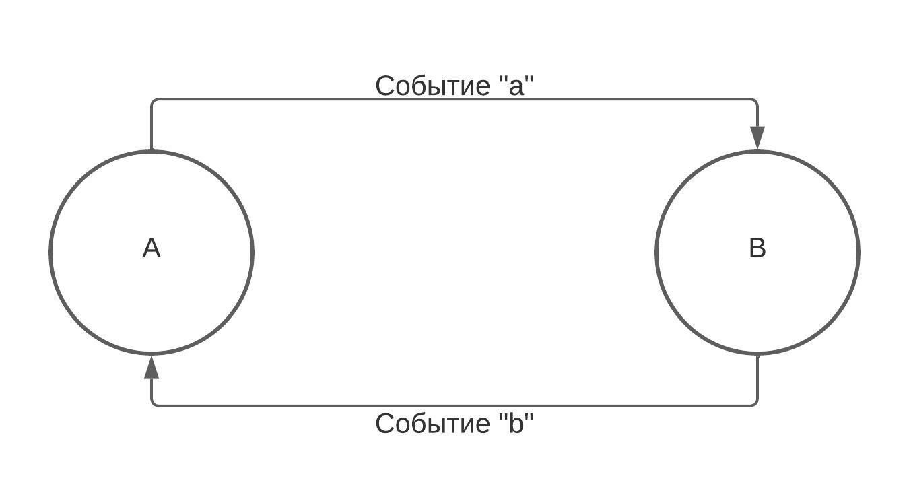
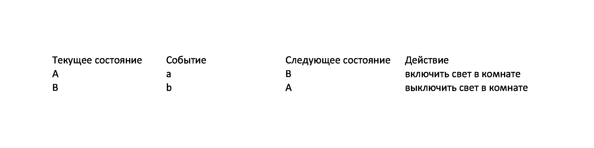

# Калькулятор

## Оглавление
1.   Задание для данной работы.
2.   Алгоритмы, используемые для выполнения данной работы.
     * Конечный автомат.
     * Древо вычисления.
3. Реализация MVC паттерна

##  Задание
* Вычисление математических выражений, подаваемых из интерфейса пользователя.
* Использование какого-либо алгоритма для обработки входных данных и вычислений
* Реализация работы интерфейса и алгоритма через паттерн MVC.
* Начисание кода должно вестись в QT старше 6-ой варсии

## Алгоритмическая часть.

### Конечный автомат.
#### Теоретическая часть.
Для начала необходимо знать некоторые термины:  конечный автомат(FSM), состояние машины, таблица переходов, лямбда-выражения.
* Определение конечного автомата из Википедии.
> Коне́чный автома́т (КА) в теории алгоритмов — математическая абстракция, модель дискретного устройства, имеющего один вход, один выход и в каждый момент времени находящегося в одном состоянии из множества возможных. Является частным случаем абстрактного дискретного автомата, число возможных внутренних состояний которого конечно.

Т.е. автомат получает на вход на вход поток символов и при определенных переходах вызывает определенное событие.

*  Состояние машины и таблица переходов.



Рассмотрим данный FSM, у него имеется 2 состояния: A и B. Каждое состояние может переходить в другое при наличии события a или b соответственно. Каждое событие вызывает действие, которое определяется программистом.

Таблица переходов будет выглядеть так, как на представленном рисунке.



На основе данного фрагмента можно придумать следующую конструкцию. Автомат будет иметь вход, в который будет посимвольно передаваться строка. Каждый символ будет влиять состояние машины, символ конца строки будет проверять правильность  последнего  состояния. Перед каждым запуском состояние автомата будет сбрасываться в стартовое.

#### Прикладная часть.
Класс FSM- класс, которые реализует сам конечный автомат. Данная конструкция должна инициализироваться таблицей переходов.
Тип transition отвечает за элемент строки в таблице переходов. В качестве шаблона указывает тип событий и тип состояний.
Рассмотрим поля класса FSM:
* _alphabet - символы, которые данная машина способна обрабатывать;
* _states - перечень всех возможных состояний;
* _events - все возможные события;
* _finishStates - все события, в которых должна находиться машина, при окончаниии обработки строки;
* _transitions - таблица переходов;
* _startState - стартовое состояние машины перед каждой обработкой строки;
* _currentState - текущее состояние машины;

Данный класс не представляет особой сложности в реализации. Главная работа начинается при создании класса обработки самой строки. (Файл находится в src/SmartCalc/Model/DefaultModel.* .)
Все методы можно разбить на группы:
1. Методы, определяющие событие:
```
bool is_PI(char s);
bool is_number(char s);
bool is_point(char s);
bool is_e(char s);
bool is_sign(char s);
bool is_operation(char s);
bool is_function(char s);
bool is_variable_char(char s);
bool is_bracketOpen(char s);
bool is_bracketClose(char s);
```
2. Методы, с помощью комбинации которых можно релизовывать необходимые действия.
```
void clearTemp();
void add_char();
void add_sign();
void addFunc();
void addOper();
void popTree();
void createNewTree();
```
3. Метод, создающий дерево вычислений, по входной строке.
```
Tree parseString(std::string const& input_string);
```